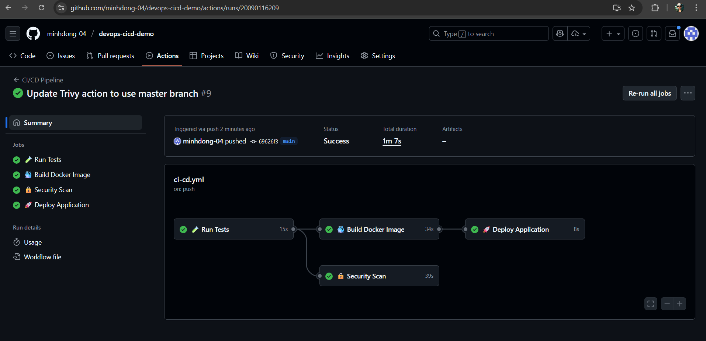
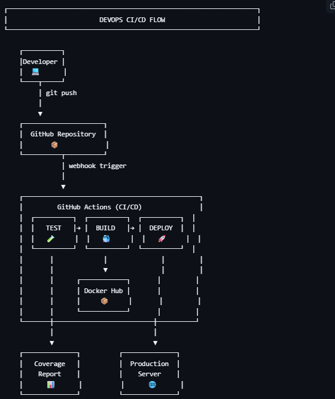

# 🚀 DevOps & CI/CD Demo Project


> **Bài tập nhóm**:  Tìm hiểu về DevOps và CI/CD - Xây dựng demo thể hiện hiểu biết của nhóm

Project demo hoàn chỉnh về **DevOps** và **CI/CD** sử dụng **Python Flask**, **Docker**, và **GitHub Actions**. Ứng dụng minh họa quy trình tự động hóa từ code, test, build đến deploy.

---

## 📑 Mục Lục

- [🎯 Giới Thiệu](#-giới-thiệu)
- [📚 Kiến Thức Nền Tảng](#-kiến-thức-nền-tảng)
  - [DevOps là gì?](#devops-là-gì)
  - [CI/CD là gì?](#cicd-là-gì)
- [🏗️ Kiến Trúc Hệ Thống](#️-kiến-trúc-hệ-thống)
- [✨ Tính Năng](#-tính-năng)
- [🛠️ Công Nghệ Sử Dụng](#️-công-nghệ-sử-dụng)
- [📦 Cài Đặt](#-cài-đặt)
- [🚀 Hướng Dẫn Chạy](#-hướng-dẫn-chạy)
- [🔄 CI/CD Pipeline](#-cicd-pipeline)
- [🧪 Testing](#-testing)
- [📊 API Endpoints](#-api-endpoints)
- [📸 Screenshots](#-screenshots)
- [👥 Thành Viên Nhóm](#-thành-viên-nhóm)
- [📖 Tài Liệu Tham Khảo](#-tài-liệu-tham-khảo)

---

## 🎯 Giới Thiệu

Project này được xây dựng nhằm mục đích: 

✅ **Hiểu rõ khái niệm DevOps**: Kết hợp Development và Operations  
✅ **Thực hành CI/CD**: Tự động hóa quy trình phát triển phần mềm  
✅ **Docker Containerization**: Đóng gói ứng dụng thành container  
✅ **Automated Testing**: Kiểm thử tự động với pytest  
✅ **GitHub Actions**: Triển khai CI/CD pipeline thực tế  

### 🎓 Mục tiêu học tập

- Nắm vững quy trình DevOps trong thực tế
- Xây dựng CI/CD pipeline từ đầu đến cuối
- Containerize ứng dụng với Docker
- Automated testing và code coverage
- Deploy tự động

---

## 📚 Kiến Thức Nền Tảng

### DevOps là gì?

**DevOps** = **Dev**elopment (Phát triển) + **Op**eration**s** (Vận hành)

DevOps là một văn hóa, phương pháp và tập hợp các công cụ nhằm: 

- 🤝 **Tăng cường hợp tác** giữa team Dev và Ops
- ⚡ **Tăng tốc độ** phát triển và triển khai phần mềm
- 🔄 **Tự động hóa** quy trình từ code đến production
- 📈 **Cải thiện chất lượng** sản phẩm liên tục
- 🔍 **Phát hiện lỗi sớm** và sửa nhanh hơn

#### Lợi ích của DevOps:

| Lợi ích | Mô tả |
|---------|-------|
| **Faster Time to Market** | Rút ngắn thời gian từ ý tưởng đến sản phẩm |
| **Improved Collaboration** | Team work hiệu quả hơn |
| **Continuous Improvement** | Cải tiến liên tục dựa trên feedback |
| **Reduced Failure Rate** | Giảm tỷ lệ lỗi khi deploy |
| **Faster Recovery** | Phục hồi nhanh khi có sự cố |

---

### CI/CD là gì? 

**CI/CD** là trụ cột chính của DevOps, bao gồm:

#### 🔄 CI - Continuous Integration (Tích hợp liên tục)

**Khái niệm**: Developer thường xuyên merge code vào nhánh chính (main/master), mỗi lần merge sẽ tự động trigger quá trình build và test. 

**Quy trình CI**:
```
Code → Commit → Push → Automated Tests → Build → Report
```

**Lợi ích**:
- ✅ Phát hiện conflict sớm
- ✅ Giảm integration issues
- ✅ Code quality được đảm bảo
- ✅ Feedback nhanh chóng

#### 🚀 CD - Continuous Delivery/Deployment (Triển khai liên tục)

**Continuous Delivery**:  Code luôn sẵn sàng để deploy, nhưng cần approve thủ công  
**Continuous Deployment**:  Tự động deploy lên production sau khi pass tests

**Quy trình CD**:
```
Build Success → Deploy to Staging → Tests → Deploy to Production
```

**Lợi ích**:
- ✅ Deploy nhanh và thường xuyên
- ✅ Giảm rủi ro khi release
- ✅ Faster feedback from users
- ✅ Reduced manual work

---

## 🏗️ Kiến Trúc Hệ Thống

```
┌─────────────────────────────────────────────────────────────┐
│                     DEVELOPER                                │
│                 (Push code to GitHub)                        │
└──────────────────────┬──────────────────────────────────────┘
                       │
                       ▼
┌─────────────────────────────────────────────────────────────┐
│                  GITHUB REPOSITORY                           │
│              (Source Code Management)                        │
└──────────────────────┬──────────────────────────────────────┘
                       │
                       ▼
┌─────────────────────────────────────────────────────────────┐
│               GITHUB ACTIONS (CI/CD)                         │
│  ┌──────────┐  ┌──────────┐  ┌──────────┐  ┌──────────┐   │
│  │   TEST   │→ │  BUILD   │→ │  DEPLOY  │  │ SECURITY │   │
│  │  pytest  │  │  Docker  │  │   Auto   │  │  Trivy   │   │
│  └──────────┘  └──────────┘  └──────────┘  └──────────┘   │
└──────────────────────┬──────────────────────────────────────┘
                       │
                       ▼
┌─────────────────────────────────────────────────────────────┐
│                    DOCKER HUB                                │
│             (Container Image Registry)                       │
└──────────────────────┬──────────────────────────────────────┘
                       │
                       ▼
┌─────────────────────────────────────────────────────────────┐
│                   PRODUCTION                                 │
│         (Docker Container Running on Server)                 │
└─────────────────────────────────────────────────────────────┘
```

### Luồng hoạt động:

1. **Developer** viết code và push lên GitHub
2. **GitHub Actions** tự động trigger CI/CD pipeline
3. **Test Job**: Chạy unit tests, kiểm tra code coverage
4. **Build Job**: Build Docker image và push lên Docker Hub
5. **Deploy Job**:  Tự động deploy container lên production
6. **Security Job**:  Scan vulnerabilities với Trivy

---

## ✨ Tính Năng

### Ứng dụng Web

- ✅ **Web Interface đẹp**: Bootstrap 5 + Custom animations
- ✅ **API Endpoints**: RESTful API với JSON response
- ✅ **Health Check**: Monitoring endpoint
- ✅ **Responsive Design**: Mobile-friendly

### DevOps Features

- ✅ **Automated Testing**: Pytest với coverage > 80%
- ✅ **Docker Support**: Multi-stage Dockerfile
- ✅ **CI/CD Pipeline**: GitHub Actions với 4 jobs
- ✅ **Code Quality**:  Linting và formatting
- ✅ **Security Scanning**: Trivy vulnerability scanner
- ✅ **Documentation**: Đầy đủ bằng Tiếng Việt

---

## 🛠️ Công Nghệ Sử Dụng

| Category | Technology | Version | Purpose |
|----------|-----------|---------|---------|
| **Language** | Python | 3.11 | Backend language |
| **Framework** | Flask | 3.0.0 | Web framework |
| **Testing** | Pytest | 7.4.3 | Unit testing |
| **Coverage** | pytest-cov | 4.1.0 | Code coverage |
| **Server** | Gunicorn | 21.2.0 | WSGI HTTP Server |
| **Container** | Docker | Latest | Containerization |
| **Orchestration** | Docker Compose | v3.8 | Multi-container |
| **CI/CD** | GitHub Actions | - | Automation |
| **Registry** | Docker Hub | - | Image storage |
| **Security** | Trivy | Latest | Vulnerability scan |

---

## 📦 Cài Đặt

### Prerequisites (Yêu cầu)

Đảm bảo bạn đã cài đặt: 

- ✅ Python 3.11+
- ✅ pip (Python package manager)
- ✅ Docker & Docker Compose
- ✅ Git
- ✅ Make (optional, for Makefile commands)

### Clone Repository

```bash
# Clone project
git clone https://github.com/minhdong-04/devops-cicd-demo.git

# Di chuyển vào thư mục project
cd devops-cicd-demo
```

---

## 🚀 Hướng Dẫn Chạy

### Cách 1: Chạy Local (Không dùng Docker)

#### Bước 1: Tạo Virtual Environment

```bash
# Tạo virtual environment
python -m venv venv

# Activate virtual environment
# Trên Linux/Mac:
source venv/bin/activate
# Trên Windows:
venv\Scripts\activate
```

#### Bước 2: Install Dependencies

```bash
# Install packages
pip install -r requirements.txt

# Hoặc dùng Makefile
make install
```

#### Bước 3: Chạy Application

```bash
# Chạy Flask app
python app.py

# Hoặc dùng Makefile
make run
```

Truy cập:  **http://localhost:5000**

---

### Cách 2: Chạy với Docker

#### Option A: Docker Run

```bash
# Build Docker image
docker build -t devops-cicd-demo: latest .

# Chạy container
docker run -d -p 5000:5000 --name devops-demo devops-cicd-demo: latest

# Xem logs
docker logs -f devops-demo
```

#### Option B: Dùng Makefile

```bash
# Build image
make docker-build

# Run container
make docker-run

# Xem logs
make docker-logs

# Stop và remove container
make docker-stop
```

---

### Cách 3: Chạy với Docker Compose (Khuyên dùng)

```bash
# Start services
docker-compose up -d

# Xem logs
docker-compose logs -f

# Stop services
docker-compose down
```

#### Hoặc dùng Makefile: 

```bash
# Start
make docker-compose-up

# Stop
make docker-compose-down
```

---

## 🔄 CI/CD Pipeline

### GitHub Actions Workflow

Pipeline tự động chạy khi:
- Push code lên nhánh `main` hoặc `develop`
- Tạo Pull Request vào `main`
- Trigger thủ công (workflow_dispatch)

### 4 Jobs trong Pipeline:

#### 1️⃣ **Test Job** 🧪

```yaml
Mục đích: Đảm bảo code quality
Các bước:
  - Checkout code
  - Setup Python 3.11
  - Install dependencies
  - Run pytest với coverage
  - Upload coverage report
Kết quả: Test report + Coverage badge
```

#### 2️⃣ **Build Job** 🐳

```yaml
Mục đích: Build và push Docker image
Điều kiện: Test job phải pass
Các bước:
  - Setup Docker Buildx
  - Login to Docker Hub
  - Build multi-stage image
  - Tag với commit SHA và 'latest'
  - Push lên Docker Hub
  - Cache layers để tăng tốc
Kết quả: Docker image trên Docker Hub
```

#### 3️⃣ **Deploy Job** 🚀

```yaml
Mục đích:  Deploy lên production
Điều kiện: Build job pass + branch = main
Các bước: 
  - Pull latest image
  - Deploy container
  - Health check
  - Comment deployment status lên commit
Kết quả: Application running on production
```

#### 4️⃣ **Security Job** 🔒

```yaml
Mục đích: Scan vulnerabilities
Các bước:
  - Chạy Trivy scanner
  - Scan filesystem và dependencies
  - Generate SARIF report
  - Upload lên GitHub Security tab
Kết quả: Security alerts (nếu có)
```

### Setup GitHub Secrets

Để CI/CD hoạt động, cần setup secrets:

```bash
# Vào GitHub repo → Settings → Secrets → Actions → New secret

DOCKER_USERNAME    # Docker Hub username
DOCKER_PASSWORD    # Docker Hub password/token
```

### Pipeline Visualization

```
┌──────────┐
│  TRIGGER │  (Push/PR)
└─────┬────┘
      │
      ▼
┌─────────────┐
│   TEST      │  Run pytest + coverage
└─────┬───────┘
      │ (pass)
      ▼
┌─────────────┐
│   BUILD     │  Docker build + push
└─────┬───────┘
      │ (pass + main branch)
      ▼
┌─────────────┐
│   DEPLOY    │  Deploy to production
└─────────────┘

      │ (parallel)
      ▼
┌─────────────┐
│  SECURITY   │  Trivy scan
└─────────────┘
```

---

## 🧪 Testing

### Chạy Tests Local

```bash
# Run all tests
pytest test_app.py -v

# Run với coverage
pytest test_app.py -v --cov=app --cov-report=term-missing

# Hoặc dùng Makefile
make test
```

### Test Coverage

Project hiện tại có **7 unit tests** cover:

- ✅ Trang chủ (index page)
- ✅ Health check endpoint
- ✅ Info endpoint
- ✅ Pipeline endpoint
- ✅ 404 error handling
- ✅ API response format validation

**Target coverage:  > 80%**

### Test Output Example

```
======================== test session starts ========================
test_app.py::test_index_page PASSED                           [ 14%]
test_app.py::test_health_endpoint PASSED                      [ 28%]
test_app.py:: test_info_endpoint PASSED                        [ 42%]
test_app.py::test_pipeline_endpoint PASSED                    [ 57%]
test_app.py::test_404_error PASSED                            [ 71%]
test_app.py::test_api_response_format PASSED                  [ 85%]
======================== 7 passed in 0.23s ==========================

---------- coverage: platform linux, python 3.11 -----------
Name      Stmts   Miss  Cover   Missing
---------------------------------------
app.py       45      2    95%   67-68
---------------------------------------
TOTAL        45      2    95%
```

---

## 📊 API Endpoints

### 1. Home Page

```http
GET /
```

**Response**:  HTML page với UI đẹp

---

### 2. Health Check

```http
GET /api/health
```

**Response**:
```json
{
  "status": "healthy",
  "timestamp": "2025-12-09T10:30:00",
  "version": "1.0.0"
}
```

**Use case**: Monitoring, load balancer health checks

---

### 3. Application Info

```http
GET /api/info
```

**Response**:
```json
{
  "app_name": "DevOps CI/CD Demo",
  "version": "1.0.0",
  "environment": "production",
  "python_version": "3.11",
  "framework": "Flask",
  "timestamp": "2025-12-09T10:30:00",
  "features": [
    "CI/CD Pipeline với GitHub Actions",
    "Docker Containerization",
    "Automated Testing",
    "Health Monitoring"
  ]
}
```

---

### 4. Pipeline Information

```http
GET /api/pipeline
```

**Response**:
```json
{
  "stages": [
    {
      "name": "Test",
      "description": "Chạy unit tests và coverage",
      "tools": ["pytest", "pytest-cov"]
    },
    {
      "name": "Build",
      "description": "Build Docker image",
      "tools": ["Docker", "docker-compose"]
    },
    {
      "name": "Deploy",
      "description": "Deploy lên production",
      "tools":  ["GitHub Actions", "Docker Hub"]
    }
  ]
}
```

---

## 📸 Screenshots

### Trang chủ


### CI/CD Pipeline


### Architecture Diagram


---

## 🎯 Makefile Commands

Project cung cấp các commands tiện lợi:

```bash
make help              # Hiển thị tất cả commands
make install           # Install dependencies
make test              # Run tests với coverage
make run               # Chạy Flask app local
make docker-build      # Build Docker image
make docker-run        # Chạy Docker container
make docker-stop       # Stop và remove container
make docker-logs       # Xem container logs
make docker-compose-up   # Start với docker-compose
make docker-compose-down # Stop docker-compose
make clean             # Dọn dẹp cache files
make lint              # Check code quality
make all               # Run:  clean → install → test → build
```

---

## 📚 Hướng Dẫn Chi Tiết

- 📖 [Docker Guide](DOCKER_GUIDE.md) - Hướng dẫn Docker chi tiết
- 📖 [CI/CD Guide](CICD_GUIDE.md) - Giải thích CI/CD pipeline
- 📖 [Presentation Template](docs/PRESENTATION.md) - Slide thuyết trình
- 📖 [Demo Script](docs/DEMO_SCRIPT.md) - Script demo chi tiết
- 📖 [Contributing Guide](CONTRIBUTING.md) - Hướng dẫn contribute

---

## 🔧 Troubleshooting

### Lỗi thường gặp:

#### 1. Port 5000 đã được sử dụng

```bash
# Kiểm tra process đang dùng port 5000
lsof -i :5000

# Kill process
kill -9 <PID>

# Hoặc đổi port
docker run -p 8000:5000 devops-cicd-demo
```

#### 2. Docker build lỗi

```bash
# Clear Docker cache
docker system prune -a

# Rebuild không cache
docker build --no-cache -t devops-cicd-demo . 
```

#### 3. Tests fail

```bash
# Đảm bảo virtual environment được activate
source venv/bin/activate

# Reinstall dependencies
pip install -r requirements.txt

# Run tests với verbose
pytest -vv
```

---

## 🤝 Contributing

Contributions are welcome!  Xem [CONTRIBUTING.md](CONTRIBUTING.md) để biết chi tiết.

### Quy trình contribute:

1. Fork repository
2.  Tạo feature branch:  `git checkout -b feature/AmazingFeature`
3. Commit changes: `git commit -m 'Add some AmazingFeature'`
4. Push to branch: `git push origin feature/AmazingFeature`
5.  Tạo Pull Request

---

## 👥 Thành Viên Nhóm

| STT | Họ và Tên | MSSV | Vai trò | GitHub |
|-----|-----------|------|---------|--------|
| 1 | [Tên thành viên 1] | [MSSV] | Team Lead | [@username1](https://github.com/username1) |
| 2 | [Tên thành viên 2] | [MSSV] | DevOps Engineer | [@username2](https://github.com/username2) |
| 3 | [Tên thành viên 3] | [MSSV] | Backend Developer | [@username3](https://github.com/username3) |
| 4 | [Tên thành viên 4] | [MSSV] | Documentation | [@username4](https://github.com/username4) |

---

## 📝 License

Project này được phát hành dưới [MIT License](LICENSE).

---

## 📖 Tài Liệu Tham Khảo

### DevOps & CI/CD
- [What is DevOps?  - AWS](https://aws.amazon.com/devops/what-is-devops/)
- [CI/CD Pipeline - Atlassian](https://www.atlassian.com/continuous-delivery/principles/continuous-integration-vs-delivery-vs-deployment)
- [GitHub Actions Documentation](https://docs.github.com/en/actions)

### Docker
- [Docker Official Docs](https://docs.docker.com/)
- [Docker Best Practices](https://docs.docker.com/develop/dev-best-practices/)
- [Multi-stage Builds](https://docs.docker.com/build/building/multi-stage/)

### Flask
- [Flask Documentation](https://flask.palletsprojects.com/)
- [Flask Testing](https://flask.palletsprojects.com/en/3.0.x/testing/)

### Testing
- [Pytest Documentation](https://docs.pytest.org/)
- [Coverage. py](https://coverage.readthedocs.io/)

---

## 🎓 Bài Học Rút Ra

Qua project này, nhóm đã học được:

1. ✅ **DevOps Culture**:  Hiểu rõ tầm quan trọng của automation
2. ✅ **CI/CD Pipeline**: Xây dựng và vận hành pipeline thực tế
3. ✅ **Docker**: Containerize application và best practices
4. ✅ **Testing**: Importance of automated testing
5. ✅ **Collaboration**: Team work với Git và GitHub
6. ✅ **Documentation**: Kỹ năng viết docs rõ ràng

### Khó khăn gặp phải: 

- 🔴 **Docker Multi-stage**:  Ban đầu image size quá lớn → Giải quyết bằng multi-stage build
- 🔴 **GitHub Actions Secrets**: Confuse về cách setup → Đọc docs kỹ hơn
- 🔴 **Test Coverage**: Đạt target 80% → Viết thêm edge case tests
- 🔴 **Port Conflicts**: Development environment → Document troubleshooting

---

## 🌟 Roadmap

### Phase 1 (Completed) ✅
- [x] Flask application với API endpoints
- [x] Unit tests với pytest
- [x] Dockerfile và docker-compose
- [x] GitHub Actions CI/CD
- [x] Documentation đầy đủ

### Phase 2 (Future)
- [ ] Deploy lên cloud (AWS/Azure/GCP)
- [ ] Kubernetes orchestration
- [ ] Monitoring với Prometheus + Grafana
- [ ] Logging với ELK Stack
- [ ] Auto-scaling
- [ ] Blue-Green Deployment

---

## 📞 Liên Hệ

Nếu có câu hỏi hoặc góp ý, vui lòng: 

- 📧 Email: [your-email@example.com]
- 🐛 Issues: [GitHub Issues](https://github.com/minhdong-04/devops-cicd-demo/issues)
- 💬 Discussions: [GitHub Discussions](https://github.com/minhdong-04/devops-cicd-demo/discussions)

---

## ⭐ Nếu thấy hữu ích, đừng quên cho project một Star!  ⭐

```
  ╔═══════════════════════════════════════════════════════╗
  ║                                                       ║
  ║   🚀 Happy Learning DevOps & CI/CD!  🚀               ║
  ║                                                       ║
  ║   Made with ❤️ by DevOps Demo Team                   ║
  ║                                                       ║
  ╚═══════════════════════════════════════════════════════╝
```

---

**[⬆ Back to top](#-devops--cicd-demo-project)**
